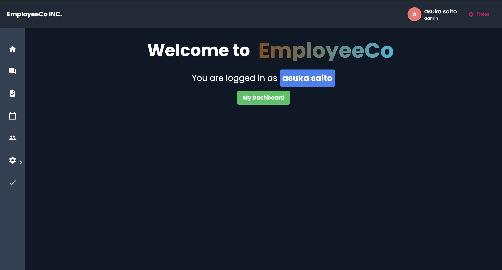
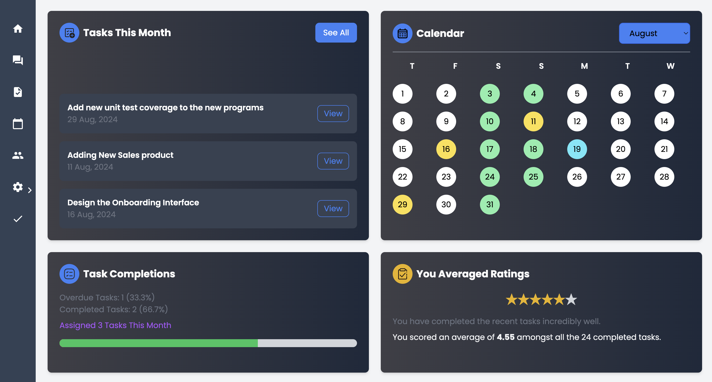

# EmployeeCo

This project frontend was generated with [Angular CLI](https://github.com/angular/angular-cli) version 18.0.6.

Employee Co is an mini Sass Employee and task mangement software developed through **Angular + Typescript** on Frontend and **C# .net** on backend maintaining a **MySQL** database on **AWS RDS**

## Tech Stacks

### UI
- **Angular Material UI**
- **Styling:** Tailwind CSS

### Front-End
- **Framework:** Angular, TypeScript
- **Payment Integration:** PayPal API
- **Forum Management:** OpenAI API, Disqus API
- **Security:** Role-guard

### Back-End
- **Language:** C#, .NET
- **Security:** JWT Bearer Authorization
- **Data Management:** OpenAI API
- **Database:** SQL Server, MySQL (RDS) managed on MySQL Workbench

### DevOps
- **Platform:** AWS
- **Front-End:** Deployed on S3 buckets with auto-scaling
- **Back-End:** Dockerized and deployed on EC2 instance under VPC route tables

### Testings:
- **FrontEnd** Karma
- **Backend**  API tested with Swagger and Postman, Unit testing with NUnit

---

## Product Overview

  

**EmployeeCo** is a comprehensive platform allowing admins to manage employees and users to manage their tasks. The dashboard provides detailed analysis of employee performance, including completion rates and task rating scores.

### Key Features:
- Admins can rate employees on task completion, manage user roles, assignments, and contact information.
- **Pro and Plus** subscriptions allow for file storage uploads.
- The integrated forum enables troubleshooting and discussion, with options for public or anonymous posts. Anonymous posts are restricted to company visibility, while public posts are processed through AI for recommendations to employees in other companies facing similar tasks.

## Development server

Run `ng serve` for a dev server. Navigate to `http://localhost:4200/`. The application will automatically reload if you change any of the source files.

## Code scaffolding

Run `ng generate component component-name` to generate a new component. You can also use `ng generate directive|pipe|service|class|guard|interface|enum|module`.

## Build

Run `ng build` to build the project. The build artifacts will be stored in the `dist/` directory.

## Running unit tests

Run `ng test` to execute the unit tests via [Karma](https://karma-runner.github.io).

## Running end-to-end tests

Run `ng e2e` to execute the end-to-end tests via a platform of your choice. To use this command, you need to first add a package that implements end-to-end testing capabilities.

## Further help

To get more help on the Angular CLI use `ng help` or go check out the [Angular CLI Overview and Command Reference](https://angular.dev/tools/cli) page.
